## 1A

Para el Apartado (a), se ha implementado un script C# que declara una variable Vector3 pública (goal) para ser configurada desde el Inspector. Siguiendo las especificaciones, el método Start() modifica este vector una única vez al inicio, reduciéndolo a la mitad (goal = goal * 0.5f;). A continuación, el método Update() aplica este vector ya modificado en cada fotograma para desplazar el objeto usando this.transform.Translate(goal);. El resultado esperado de este experimento es que el objeto, asumiendo un goal inicial distinto de cero, no frene ni dé saltos decrecientes, sino que se mueva a una velocidad constante y muy elevada en la dirección del vector, ya que la misma traslación se aplica repetidamente en cada fotograma.
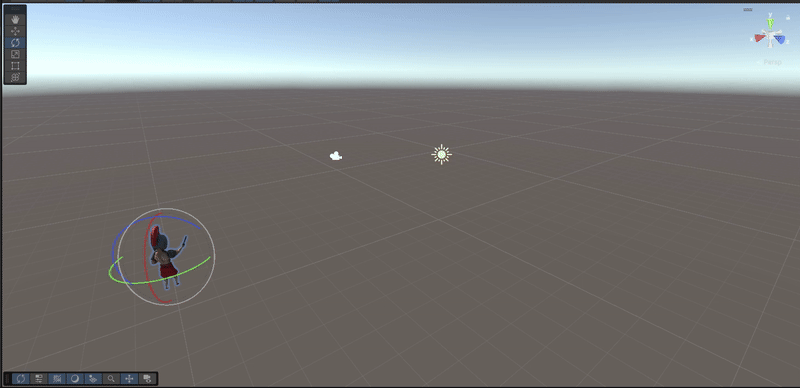
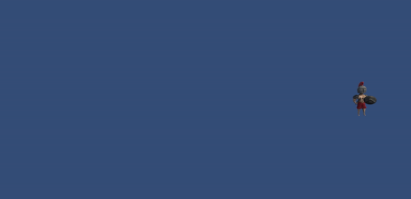
## 1B
Al poner la coordenada Y del goal en 0, el vector de movimiento no tendrá componente vertical.
El objeto se moverá a la misma velocidad constante y rápida que en el experimento (a), pero lo hará únicamente en el plano horizontal (X/Z). El objeto no subirá ni bajará, simplemente se deslizará por el "suelo" (o el plano donde esté situado).
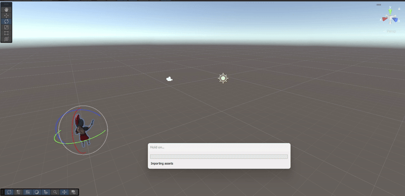
## 1C
Al tener un valor en Y, el vector goal ahora tiene un componente vertical.
Cuando ejecutes la escena, el objeto se moverá a la misma velocidad constante y rápida de antes, pero esta vez lo hará en una dirección diagonal. Se desplazará horizontalmente (en X) y verticalmente (en Y) al mismo tiempo. Si Y es positivo, "despegará" en diagonal; si Y es negativo, se moverá en diagonal hacia abajo.
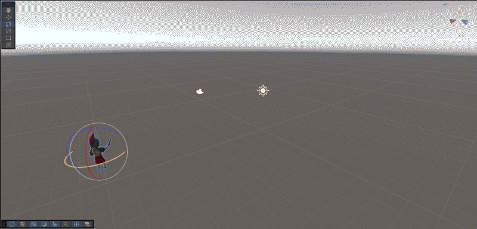
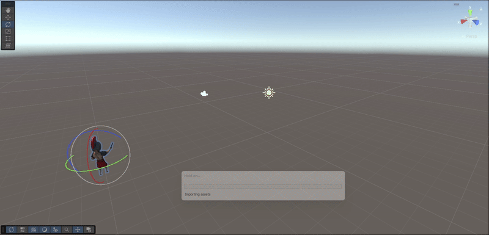
## 1D
Este script aplica un movimiento constante en el eje Y (vertical) y Z (avance) del objeto en cada fotograma. Lo que se espera conseguir es que el objeto simule un despegue, moviéndose en diagonal hacia arriba y adelante; sin embargo, dado que el movimiento se aplica directamente en Update sin Time.deltaTime, la velocidad real será dependiente de los fotogramas por segundo (FPS) de la computadora. Esto obliga a usar valores muy pequeños en las variables de velocidad (como 0.2) para que el objeto no se dispare de la pantalla instantáneamente, y el movimiento será inconsistente entre diferentes máquinas.
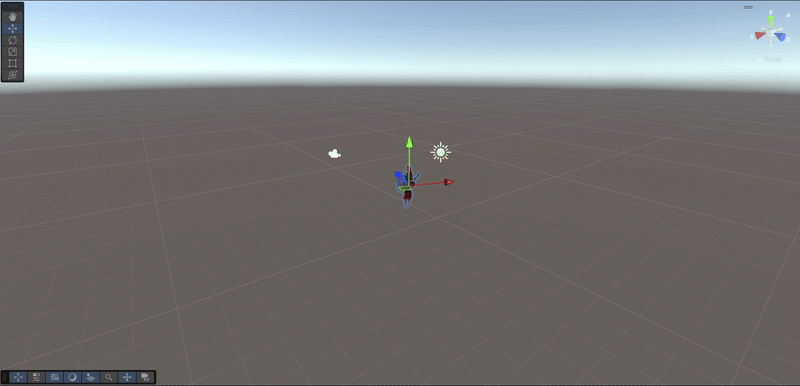
## 1E
Sí, el movimiento es perfectamente consistente.el objeto se moverá en la misma dirección exacta que antes, pero al doble de velocidad. La primera imagen va a 0.01 y la segunda a 0.02.

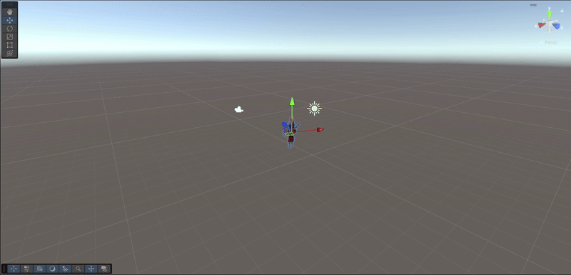

## 2A
Este script toma el vector goal (la dirección) y, antes de mover el objeto, lo normaliza, es decir, lo convierte en un vector con la misma dirección pero con una longitud (magnitud) exacta de 1. El resultado esperado es que el objeto se mueva a una velocidad constante en la dirección de goal, sin importar qué tan grandes o pequeños sean los números que pongas en el Inspector (ej: (2,0,0) y (100,0,0) producirán la misma velocidad).
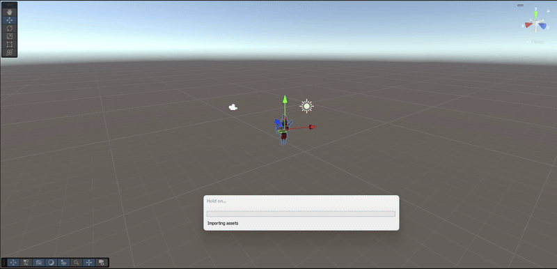
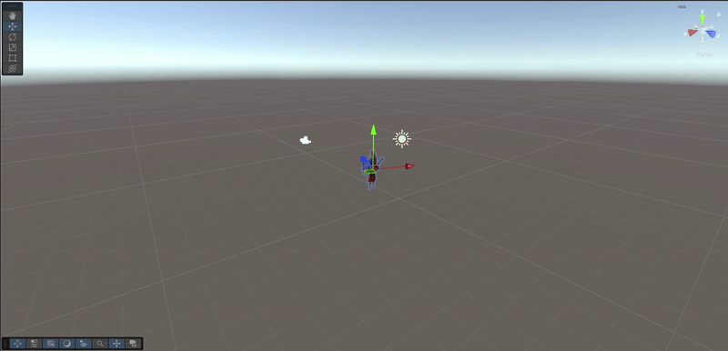
## 2B
En este script, se ha perfeccionado el paso anterior al separar la dirección del movimiento de la velocidad. Lo que se ha hecho es, primero, normalizar el vector goal (para obtener solo su dirección, ignorando su magnitud) y, segundo, multiplicarlo por una nueva variable pública speed. Lo que se espera conseguir es un movimiento más controlable: el objeto se moverá en la dirección de goal, pero su velocidad ahora estará determinada limpiamente por la variable speed, sin importar si en goal pones (1,0,0) o (100,0,0). Sin embargo, como este cálculo sigue estando en Update y no usa Time.deltaTime, la velocidad sigue siendo "unidades por fotograma", lo que la hace dependiente de los FPS e inconsistente entre diferentes máquinas.
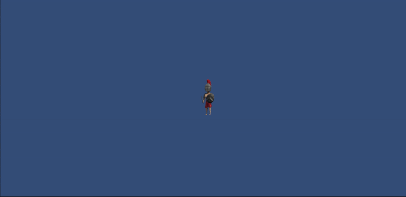
## 2C
Este script implementa el método estándar y correcto para mover un objeto en Unity. Lo que hace es tomar el vector goal únicamente para obtener su dirección (ignorando su magnitud gracias a .normalized), lo multiplica por una variable pública speed para controlar la velocidad, y finalmente lo ajusta con Time.deltaTime. El resultado esperado es el movimiento más consistente y profesional: el objeto se desplazará de manera perfectamente suave, en la dirección de goal, a una velocidad constante medida en "unidades por segundo" (definida por speed), independientemente de los fotogramas por segundo (FPS) a los que se ejecute el juego.

## 3A
Este script inicial simplemente define las variables que se usarán en los siguientes pasos, pero todavía no contiene ninguna lógica de movimiento. Se han creado dos campos públicos: goal (de tipo Transform), que servirá para arrastrar desde el Inspector el objeto que queremos "perseguir", y speed, que nos permitirá ajustar la velocidad del movimiento.

## 3B
En este paso se añade la lógica de rotación al script. La instrucción this.transform.LookAt(goal.position) se ha colocado en el método Start(). Esta función de Unity calcula la rotación necesaria para que el eje Z local (el "frente") del objeto apunte directamente hacia la posición del Transform asignado en la variable goal. Al estar en Start(), esta acción se ejecuta una única vez, en el momento exacto en que la escena comienza.
el objeto rotará instantáneamente una sola vez para quedar "encarando" al objetivo que se le haya asignado.
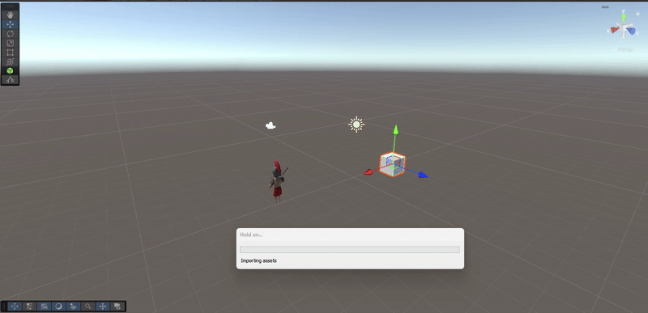
## 3C
Se añade la lógica de movimiento al método Update(), que se ejecuta en cada fotograma. Primero, se calcula el vector direction restando la posición actual del objeto (this.transform.position) de la posición del objetivo (goal.position). Luego, se usa this.transform.Translate para mover el objeto usando ese vector normalizado, escalado por la speed y ajustado por Time.deltaTime. 
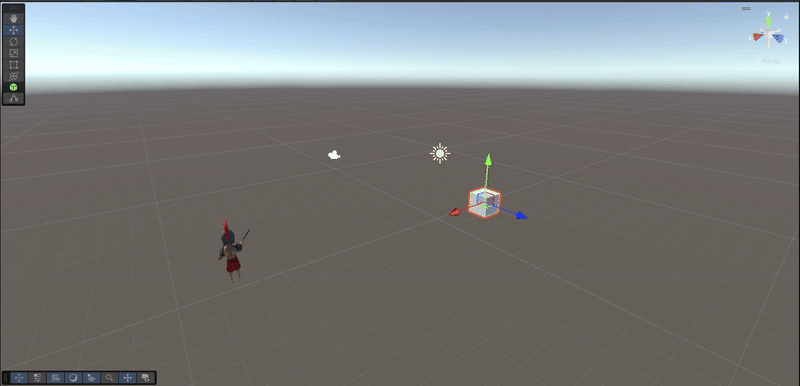

El resultado visual es que el objeto no se moverá en línea recta hacia el objetivo. Al estar girado, interpretará el vector de dirección del "Mundo" en su propio sistema de ejes "Local", haciendo que se desplace de lado o en un arco extraño

Corrige el problema de movimiento lateral del paso anterior. Lo que se ha hecho es añadir el parámetro Space.World al método Translate. Esto es crucial porque el vector direction (la resta entre el objetivo y el objeto) se calcula en coordenadas del Mundo; al especificar Space.World, nos aseguramos de que el movimiento se aplique usando los ejes globales (Norte, Sur, Este, Oeste), en lugar de los ejes locales del objeto (su "adelante", "derecha", etc.)

## 4
Añadir Debug.DrawRay(this.transform.position,direction,Color.red) depuración para comprobar que la dirección está correctamente calculada. Simplemente se añade una linea de color rojo que confirma que sigue la direccion
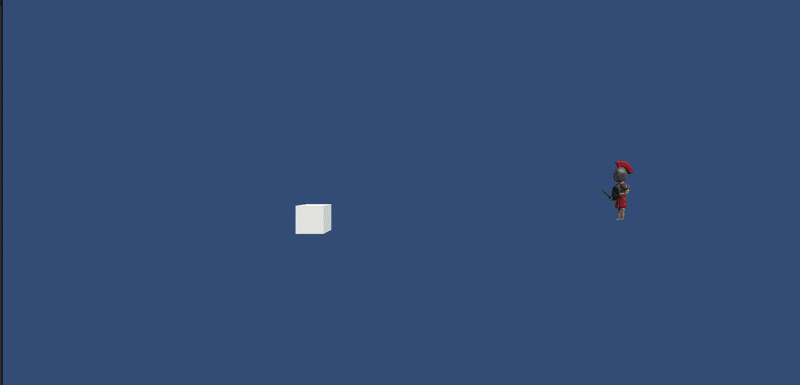

## 5A
Este script está diseñado para que un objeto (el personaje) persiga a un objetivo (goal) de forma continua. En cada fotograma, el método Update realiza dos acciones clave: primero, utiliza this.transform.LookAt para reorientar al personaje, asegurando que siempre esté "encarando" al objetivo, sin importar dónde se mueva. Segundo, calcula la dirección hacia el objetivo (restando posiciones) y aplica una traslación normalizada y suavizada por tiempo (Time.deltaTime) en el espacio del mundo (Space.World), haciendo que el personaje avance constantemente hacia el goal a una velocidad base de 1.0 unidad por segundo.ç
Script Anterior (MoverHaciaTransform): Ponía this.transform.LookAt(goal.position) en el método Start().
Script Nuevo (SeguirObjetivo): Pone this.transform.LookAt(goal.position) en el método Update()
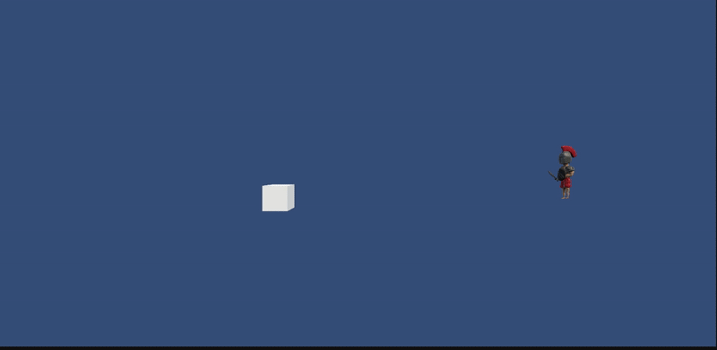
## 5B
Este script implementa el apartado (b) añadiendo la variable public float speed = 1.0f; al inicio de la clase. Esta nueva variable, al ser pública, aparece en el Inspector de Unity. Luego, se ha modificado la línea de Translate en el método Update para que multiplique el movimiento por esta variable speed, permitiendo así que el valor definido en el Inspector controle qué tan rápido se mueve el objeto.
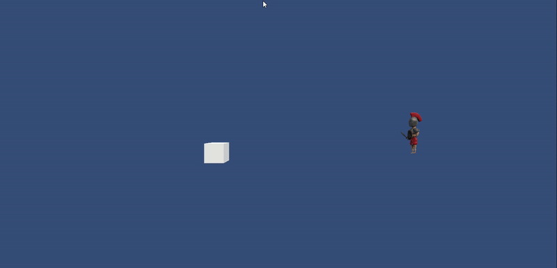
## 5C
Este script añade la funcionalidad de "sprint" o aceleración. Lo que se ha hecho es añadir una nueva variable pública, incrementoDeVelocidad, y una comprobación if dentro del método Update. Esta comprobación utiliza Input.GetKeyDown(KeyCode.Space) para detectar el momento exacto en que el jugador pulsa la barra espaciadora. Cuando esto ocurre, el valor de incrementoDeVelocidad se suma a la variable speed actual, aumentando permanentemente (mientras dure la ejecución) la velocidad del personaje.
en el inspector le añado un valor de 0.5f a una velocidad de 3
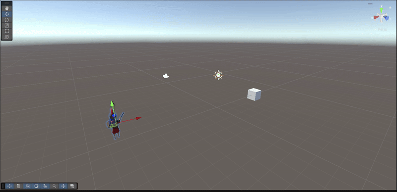
## 6A
Este script implementa el movimiento rectilíneo usando el sistema de referencia local del objeto. En cada fotograma, el método Update ejecuta dos órdenes: primero, utiliza transform.LookAt para rotar al personaje, asegurando que su eje Z local (su "frente") apunte directamente al goal. Inmediatamente después, aplica una traslación usando Vector3.forward, que es una instrucción local que significa "avanza en la dirección de tu propio eje Z
El resultado esperado es que el personaje perseguirá al objetivo de forma eficiente y directa. En todo momento, el personaje estará rotando para "mirar" al objetivo y, simultáneamente, avanzará en línea recta hacia donde está mirando. Si mueves el objetivo (goal) por la escena, el personaje ajustará su rotación en tiempo real y continuará su avance rectilíneo hacia la nueva posición del objetivo.
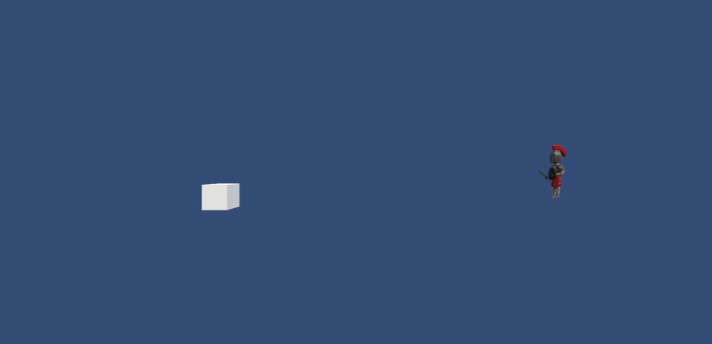
## 6B
Este script, al igual que el anterior, gira al personaje en cada fotograma para que encare al objetivo (LookAt). Sin embargo, en lugar de moverse usando Vector3.forward (su eje Z local), este script calcula el vector de dirección exacto que une al personaje con su objetivo (goal.position - transform.position). Luego, normaliza este vector y lo usa para la traslación. Crucialmente, como no se especifica Space.World, el Translate se aplica por defecto en el sistema de referencia local del objeto.
El resultado será un movimiento incorrecto y errático. El personaje girará correctamente para mirar al objetivo, pero al intentar aplicar el vector de dirección (que está en coordenadas del Mundo) a sus ejes locales, no se moverá en línea recta
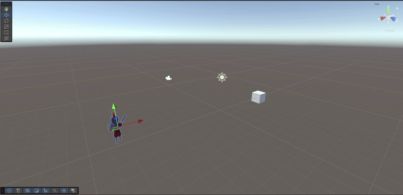
## 6C
Este script es la solución correcta al problema de movimiento planteado en el apartado anterior. Al igual que el script (b), gira al personaje para encarar al objetivo (LookAt) y calcula la dirección exacta hacia él (un vector en coordenadas del Mundo). La diferencia crucial es que al método Translate se le añade el parámetro Space.World. Esto fuerza a que el movimiento se aplique usando los ejes del sistema de referencia Mundial (Norte/Sur/Este/Oeste), en lugar de los ejes locales 
El resultado esperado es un movimiento directo y lógico. El personaje girará continuamente para mirar al objetivo y avanzará en una línea recta perfecta hacia él, sin el movimiento "de cangrejo"
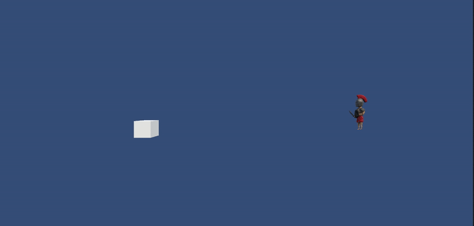

## 7A
Este script implementa el apartado (a) para solucionar el "jittering" (la vibración) al llegar al objetivo. Se ha añadido una variable pública accuracy que define un rango de tolerancia o proximidad. En el método Update, antes de ejecutar cualquier movimiento, se calcula la dirección y luego se comprueba si la magnitud de ese vector direction (que equivale a la distancia exacta entre el objeto y su objetivo) es mayor que el valor de accuracy. Toda la lógica de rotación (LookAt) y traslación (Translate) se ha encapsulado dentro de este if, de modo que el personaje solo intentará girar y moverse si está fuera de ese pequeño radio de destino.
El resultado esperado es que el personaje perseguirá al objetivo de la misma forma que en el script anterior, pero una vez que entre en el radio de tolerancia (por ejemplo, a 0.01 unidades del goal), la condición del if será falsa y el personaje se detendrá por completo.
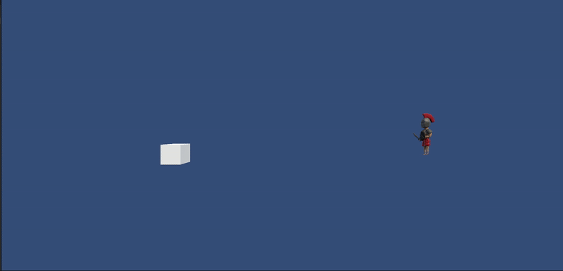
## 7B
Este script implementa el apartado (b) como un método alternativo para lograr el mismo objetivo que el apartado (a). En lugar de calcular primero el vector direction y luego medir su .magnitude (longitud), este script utiliza la función Vector3.Distance().Esta función es un atajo más directo y legible que calcula la distancia exacta entre dos puntos: la posición del personaje (this.transform.position) y la posición del objetivo (goal.position).
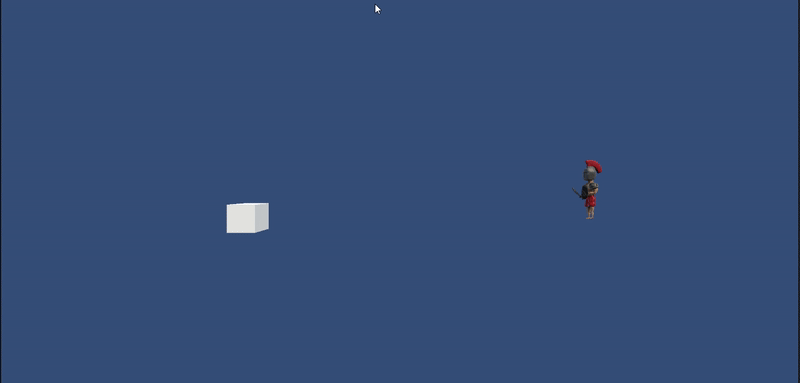
## 8 
Este script consigue el mismo objetivo (giro suave) pero usando el método que coincide con tus notas. En lugar de interpolar las rotaciones finales (Quaternion), interpola los vectores de dirección (Vector3). En cada fotograma, define la dirección actual (this.transform.forward) y la dirección objetivo (targetDirection). Luego, utiliza Vector3.Slerp para encontrar un nuevo vector de dirección que está "a medio camino" entre los dos, controlado por la rotationSpeed. Finalmente, usa Quaternion.LookRotation para aplicar esa nueva dirección interpolada como la rotación del personaje, y lo mueve hacia adelante.
Resultado Esperado
El resultado visual es casi idéntico al del script anterior: el personaje girará suavemente y con un "radio de giro" para encarar y perseguir al objetivo, en lugar de girar bruscamente.
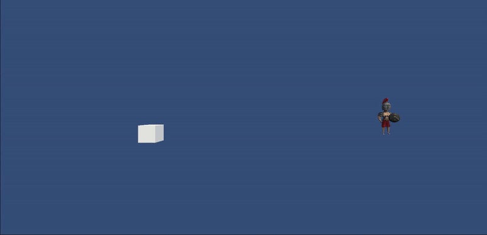

